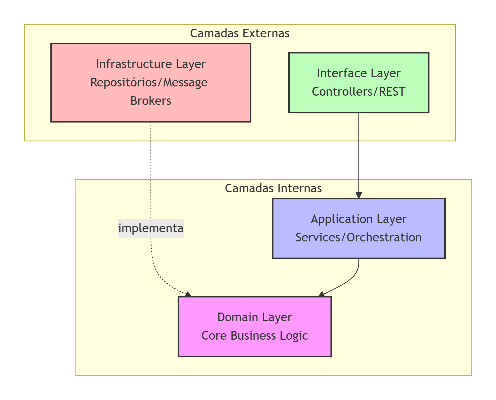
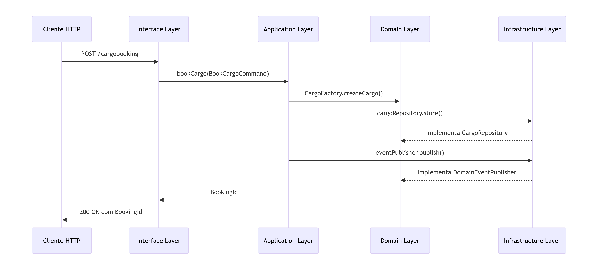

# BookingMS - Sistema de Reserva de Carga

Uma aplicação Java baseada em **Domain-Driven Design (DDD)** e **Arquitetura Hexagonal/Onion** para gerenciamento de reservas e roteamento de cargas.

## 📋 Visão Geral

O BookingMS é um microsserviço responsável pelo gerenciamento de reservas de carga, incluindo:
- Criação de reservas (booking)
- Atribuição de rotas às cargas
- Publicação de eventos de domínio
- Integração com serviços externos de roteamento

## 🏗️ Arquitetura

### Estrutura de Diretórios

```
bookingms/src/main/java/com/practicalddd/cargotracker/bookingms/
├── application/          # Camada de aplicação
│   ├── internal/
│   │   ├── commandservices/  # Serviços de comando
│   │   ├── queryservices/    # Serviços de consulta
│   │   └── events/           # Interfaces de eventos
├── domain/               # Camada de domínio (núcleo)
│   └── model/
│       ├── aggregates/       # Agregados
│       ├── commands/         # Objetos de comando
│       ├── entities/         # Entidades
│       ├── events/           # Eventos de domínio
│       ├── exceptions/       # Exceções específicas
│       ├── factory/          # Fábricas
│       ├── repositories/     # Interfaces de repositório
│       ├── services/         # Serviços de domínio
│       └── valueobjects/     # Value Objects
├── infrastructure/       # Camada de infraestrutura
│   ├── brokers/rabbitmq/     # Configuração RabbitMQ
│   ├── events/rabbitmq/      # Publicação de eventos
│   ├── persistence/          # Persistência de dados
│   │   ├── jpa/entities/     # Entidades JPA
│   │   ├── mappers/          # Mapeadores
│   │   └── repositories/jpa/ # Implementações de repositório
│   └── services/             # Serviços externos
├── interfaces/           # Camada de interfaces
│   └── rest/
│       ├── dto/              # Data Transfer Objects
│       ├── transform/        # Conversores DTO-Command
│       ├── CargoBookingController.java
│       └── CargoRoutingController.java
└── shareddomain/         # Domínio compartilhado
    ├── events/               # Eventos compartilhados
    └── model/                # Modelos compartilhados
```

## 🎯 Princípios Arquiteturais

### 1. **Camada de Domínio (Core)**
- **Localização**: `domain/`
- **Responsabilidade**: Lógica de negócio central
- **Componentes**:
  - Aggregates (ex: `Cargo`)
  - Entities (ex: `Leg`)
  - Value Objects (ex: `BookingId`, `RouteSpecification`)
  - Domain Services (ex: `ExternalRoutingService`)
  - Domain Events (ex: `CargoBookedEvent`)
  - Repository Interfaces
  - Domain Exceptions

### 2. **Camada de Aplicação**
- **Localização**: `application/`
- **Responsabilidade**: Orquestração de casos de uso
- **Componentes**:
  - Command Services (operações de escrita)
  - Query Services (operações de leitura)
  - Event Publishers (interface)

### 3. **Camada de Infraestrutura**
- **Localização**: `infrastructure/`
- **Responsabilidade**: Implementações concretas e integrações externas
- **Componentes**:
  - Repository Implementations (JPA)
  - Event Publishing (RabbitMQ)
  - External Service Clients (REST)
  - Database Entities (JPA)

### 4. **Camada de Interfaces**
- **Localização**: `interfaces/`
- **Responsabilidade**: Expõe a aplicação para clientes externos
- **Componentes**:
  - REST Controllers
  - DTOs (Data Transfer Objects)
  - Assemblers (conversão DTO ↔ Command)

### 5. **Domínio Compartilhado**
- **Localização**: `shareddomain/`
- **Responsabilidade**: Modelos e eventos compartilhados entre bounded contexts
- **Componentes**:
  - Shared Events
  - Shared Data Models


## 🔄 Fluxo de Dependências e Inversão de Controle

### 📐 **Diagrama de Dependências**




### 🔀 **Direção das Dependências**

```
┌─────────────────────────────────────────────────────────────┐
│                    Direção das Dependências                  │
├─────────────────────────────────────────────────────────────┤
│  Interface Layer    →   Application Layer   →   Domain Layer │
│        ↑                                                    │
│        └────────────────────────────────────────────────────┤
│                 Infrastructure Layer                         │
│          (implementa interfaces do Domain Layer)             │
└─────────────────────────────────────────────────────────────┘
```

### 🎯 **Princípios de Dependência**

| Princípio | Descrição | Exemplo no Código |
|-----------|-----------|-------------------|
| **Dependência para Dentro** | Camadas externas dependem de camadas internas | `CargoBookingController` → `CargoBookingCommandService` |
| **Domínio Isolado** | Domain Layer não referencia camadas externas | `CargoRepository` (interface) definida no domínio |
| **Inversão de Dependência** | Infra implementa interfaces do domínio | `CargoRepositoryImpl` implementa `CargoRepository` |
| **Abstração sobre Implementação** | Uso de interfaces para desacoplamento | `DomainEventPublisher` interface |

### 📊 **Detalhamento das Dependências**

#### **Interface Layer → Application Layer**
```java
// interfaces/rest/CargoBookingController.java
@Inject
public CargoBookingController(CargoBookingCommandService cargoBookingCommandService) {
    // Dependência: Controller → Application Service
    this.cargoBookingCommandService = cargoBookingCommandService;
}
```

#### **Application Layer → Domain Layer**
```java
// application/internal/commandservices/CargoBookingCommandService.java
@Inject
private CargoRepository cargoRepository;  // Interface do domínio

@Inject
private DomainEventPublisher eventPublisher;  // Interface do domínio

@Inject
private ExternalRoutingService externalRoutingService;  // Interface do domínio
```

#### **Infrastructure Layer → Domain Layer**
```java
// infrastructure/repositories/jpa/CargoRepositoryImpl.java
@ApplicationScoped
public class CargoRepositoryImpl implements CargoRepository {
    // Implementação da interface definida no domínio
}

// infrastructure/events/rabbitmq/RabbitMQDomainEventPublisher.java
@ApplicationScoped
public class RabbitMQDomainEventPublisher implements DomainEventPublisher {
    // Implementação da interface definida no domínio
}
```

### 🔄 **Fluxo de Chamadas Típico**



### ✅ **Benefícios da Arquitetura**

1. **Testabilidade** - Domínio pode ser testado sem infraestrutura
2. **Substituibilidade** - Implementações de infra podem ser trocadas
3. **Manutenibilidade** - Mudanças em uma camada não afetam outras
4. **Clareza** - Responsabilidades bem definidas por camada

### ⚠️ **Pontos de Atenção**

- **Interface Layer** não deve conter lógica de negócio
- **Application Layer** coordena, mas não implementa regras de negócio
- **Domain Layer** deve ser puro, sem dependências de framework
- **Infrastructure Layer** só conhece o domínio através de interfaces

- As **dependências fluem para dentro**: camadas externas dependem de camadas internas
- O **domínio não conhece** a infraestrutura ou interfaces
- **Inversão de Dependência**: interfaces são definidas no domínio, implementadas na infraestrutura

## 🚀 Fluxos de Execução

### 1. **Reserva de Carga (Book Cargo)**
```
Cliente HTTP → CargoBookingController → BookCargoCommand
    → CargoBookingCommandService → CargoFactory
    → CargoRepository → Event Publisher → RabbitMQ
```

### 2. **Roteamento de Carga (Route Cargo)**
```
Cliente HTTP → CargoRoutingController → RouteCargoCommand
    → CargoBookingCommandService → ExternalRoutingService
    → CargoRepository → Event Publisher → RabbitMQ
```

## 📦 Componentes Principais

### Agregado `Cargo`
- Agregado raiz do contexto de reserva
- Contém: BookingId, RouteSpecification, CargoItinerary, Delivery
- Responsável por invariantes de consistência

### Value Objects
- `BookingId`: Identificador único da reserva
- `RouteSpecification`: Origem, destino e prazo de entrega
- `CargoItinerary`: Rota com lista de `Leg`
- `Delivery`: Status de roteamento e transporte

### Eventos de Domínio
- `CargoBookedEvent`: Publicado quando uma carga é reservada
- `CargoRoutedEvent`: Publicado quando uma rota é atribuída

## 🛠️ Tecnologias Utilizadas

- **Java EE / Jakarta EE**: Injeção de dependência, JPA, JAX-RS
- **JPA (Hibernate)**: Persistência de dados
- **RabbitMQ**: Mensageria para eventos de domínio
- **REST**: APIs HTTP para integração
- **MicroProfile REST Client**: Cliente para serviços externos

## ✅ Práticas de DDD Implementadas

1. **Aggregates**: `Cargo` como aggregate root
2. **Value Objects**: Objetos imutáveis com semântica de valor
3. **Domain Events**: Eventos que representam mudanças significativas
4. **Repository Pattern**: Abstração de persistência
5. **Factory Pattern**: Criação de objetos complexos
6. **Bounded Context**: Contexto delimitado de Booking
7. **Ubiquitous Language**: Terminologia consistente no código

## 🔧 Configuração e Execução

```bash
# Compilar o projeto
mvn clean compile

# Executar testes
mvn test

# Executar a aplicação
mvn exec:java
```

## 📚 Dependências Externas

- **RoutingMS**: Serviço externo para cálculo de rotas ótimas
- **RabbitMQ**: Broker de mensagens para eventos
- **Database**: MySQL para persistência

## 🔍 Monitoramento e Logs

- Logs configurados via `logging.properties`
- Eventos publicados via RabbitMQ para tracking
- APIs REST para consulta de status

---

**Nota**: Esta aplicação segue os princípios de Clean Architecture, mantendo o domínio independente de frameworks e bibliotecas externas, facilitando testes e manutenção.